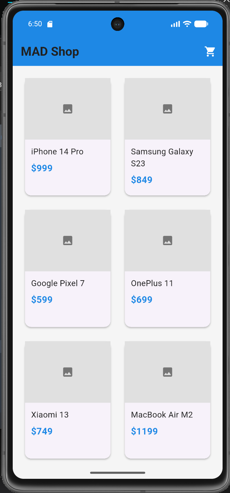
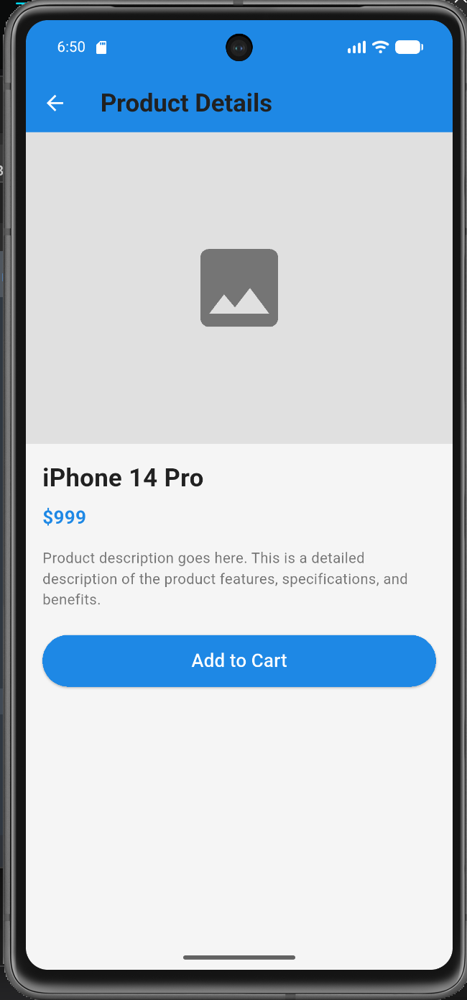
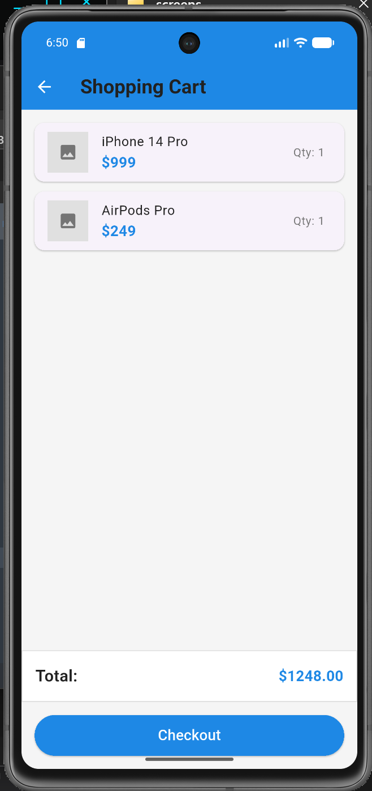

# MAD Shop Mobile App UI

## Описание проекта
Реализация мобильного приложения MAD Shop по макету из Figma с использованием Flutter.

## Сверстанные экраны
- ✅ Главный экран с сеткой товаров
- ✅ Экран деталей товара
- ✅ Экран корзины покупок

## Использованные элементы
- **Виджеты компоновки**: `GridView`, `Column`, `Row`, `Stack`, `Card`, `ListTile`
- **Навигация**: `Navigator.push()`, `MaterialPageRoute`
- **Стилизация**: Кастомные `AppColors` и `AppTextStyles`
- **Состояние**: Stateless widgets для статического UI

## Отличия от макета
- Использованы placeholder вместо реальных изображений
- Упрощенная логика корзины (без состояния)
- Базовая цветовая схема без точного соответствия макету

## UI/UX анализ
### Удачные решения:
- Чистая и понятная структура экранов
- Единая система цветов и стилей
- Интуитивная навигация между экранами

### Требует доработки:
- Добавление реальных изображений товаров
- Реализация состояния приложения (State Management)
- Анимации переходов между экранами
- Адаптивность для разных размеров экранов

## Скриншоты

### Главный экран


### Экран товара


### Корзина


## Установка и запуск
```bash
flutter pub get
flutter run